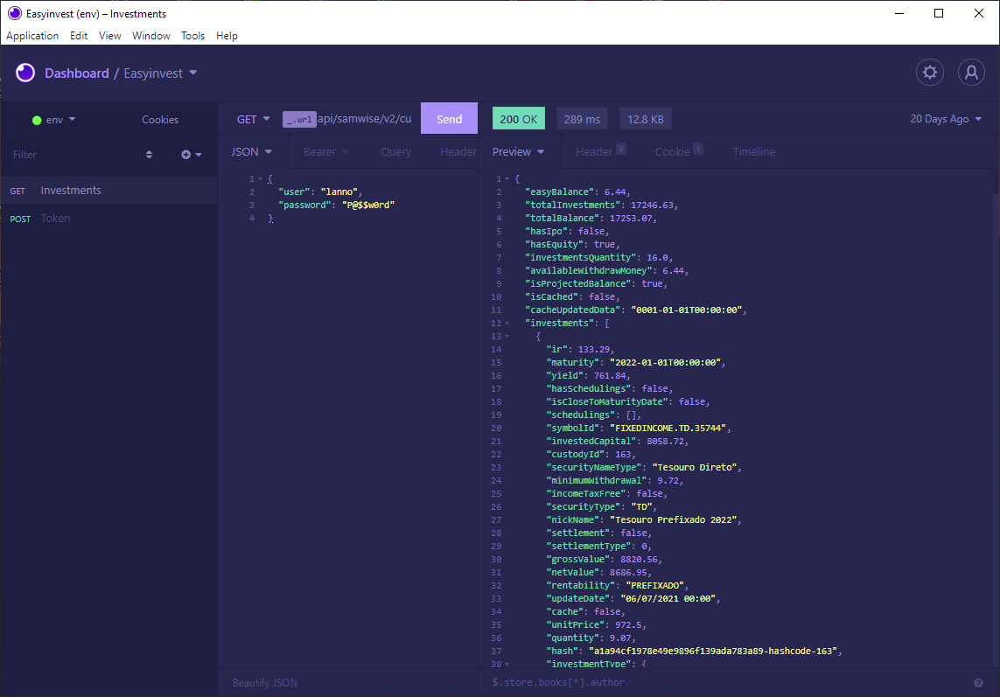

  

<h1 align="center">Night Storm for <a href="https://insomnia.rest/">Insomnia</a></h1>

A dark theme for **Insomnia** better for your eyes

## Screenshot

#### Install

1. In Insomnia, go to _Application_ and select _Preferences_
2. Click on _Plugins_
3. Paste `insomnia-plugin-theme-night-storm` into the package name field
4. Click on _Install Plugin_

#### Activating theme

1. Go to _Application_ and select _Preferences_
2. Click on _Themes_
3. Select **Night Storm** to apply the theme

## License

[MIT License](./LICENSE)
